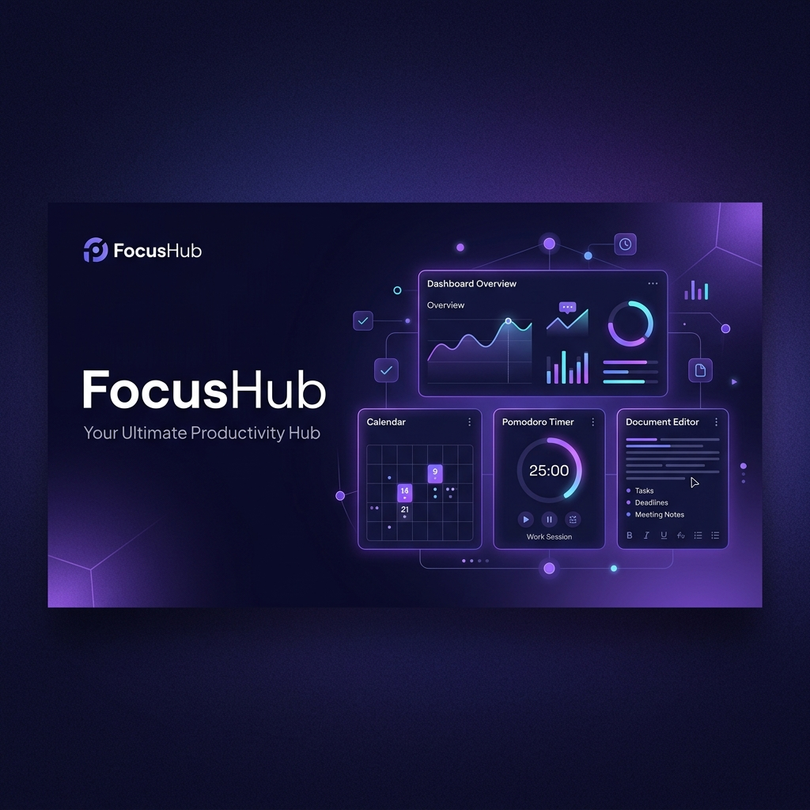

# ⚡ FocusHub — Integrated Personal Productivity Management

<p align="center">
  
</p>

<p align="center">
  <a href="https://github.com/luutranminhhieu/Desktop-App-for-Integrated-Personal-Productivity-Management">
    
  </a>
  <a href="https://electronjs.org">
    
  </a>
  <a href="https://react.dev">
    
  </a>
  <a href="https://tailwindcss.com">
    
  </a>
  <a href="https://typescriptlang.org">
    
  </a>
  <a href="https://mongodb.com">
    
  </a>
</p>

---

## 📌 Giới thiệu dự án (About)

### 🎯 Dự án làm gì?
**FocusHub** (tên dự án gốc: *promos*) là một ứng dụng máy tính đa nền tảng (Cross-platform Desktop Application) hỗ trợ quản lý hiệu suất công việc cá nhân tích hợp (**Integrated Personal Productivity Management**). Dự án được thiết kế tỉ mỉ nhằm cung cấp cho người dùng một không gian làm việc liền mạch, hiệu quả và tối giản.

### 💡 Tại sao nó ra đời?
Trong môi trường làm việc hiện đại, sự phân mảnh công cụ (ghi chú, lên lịch biểu, theo dõi công việc, đếm ngược Pomodoro trên các phần mềm khác nhau) dẫn đến tình trạng mất tập trung do liên tục chuyển đổi ngữ cảnh (**Context Switching**). FocusHub ra đời để giải quyết triệt để vấn đề này, tích hợp tất cả các tiện ích năng suất cốt lõi vào một cửa sổ máy tính thống nhất.

### 🛠️ Giải quyết vấn đề gì?
*   **Tránh phân tâm**: Hợp nhất các tác vụ ghi chép, lập kế hoạch, đếm giờ Pomodoro và theo dõi tiến độ trong một ứng dụng duy nhất.
*   **Chống đóng băng tiến trình (CPU Throttling)**: Bộ đếm giờ Pomodoro chạy trực tiếp ở tiến trình nền hệ thống (Node.js Main Process) thay vì Renderer/Browser, đảm bảo độ chính xác tuyệt đối ngay cả khi ứng dụng bị thu nhỏ.
*   **Đồng bộ thời gian thông minh**: Tự động chuyển đổi hạn chót (Deadlines) của các công việc sang dạng sự kiện trên Lịch biểu (FullCalendar) mà không cần nhập liệu dư thừa.
*   **Báo cáo năng suất trực quan**: Bản đồ nhiệt năng suất (Productivity Heatmap) 12 tuần giúp người dùng nhìn lại tổng quan nỗ lực hàng ngày.

---

## 🌟 Tính năng nổi bật (Key Modules)

### 1. 📊 Bảng điều khiển hiệu suất (Performance Dashboard)
*   **Lời chào động**: Lời chào thay đổi theo Sáng / Chiều / Tối cùng thống kê công việc tự động.
*   **Thẻ tiến độ tập trung**: Hiển thị tỷ lệ mục tiêu tập trung trong ngày dưới dạng vòng tròn tiến độ SVG và ghi nhận chuỗi ngày làm việc liên tục (Streak 🔥).
*   **Biểu đồ phân tích**: Biểu đồ đường (Line Chart) biểu diễn thời lượng tập trung và biểu đồ tròn (Donut Chart) thống kê tỷ lệ hoàn thành công việc.
*   **Bản đồ nhiệt năng suất (Productivity Heatmap)**: Trực quan hóa mức độ chăm chỉ suốt 12 tuần qua theo phong cách đóng góp của GitHub.
*   **Châm ngôn động**: Cung cấp các câu nói truyền cảm hứng của các danh nhân, thay đổi mỗi ngày.

<p align="center">
  
</p>

### 2. 📝 Quản lý công việc thông minh (Smart Todo List)
*   **Phân chia độ ưu tiên**: Phân loại công việc trực quan theo các mức độ khẩn cấp (Urgent, High, Work).
*   **Chi tiết giàu văn bản**: Cho phép ghi chú chi tiết đính kèm cho từng công việc bằng trình soạn thảo Tiptap Editor.
*   **Bộ lọc linh hoạt**: Dễ dàng phân nhóm theo các khoảng thời gian (Hôm nay, Tuần này, Tháng này) hoặc trạng thái.

<p align="center">
  
</p>

### 3. 📅 Lịch biểu động (Integrated Calendar)
*   **Xem đa góc độ**: Hỗ trợ chế độ xem theo Ngày, Tuần (mặc định) và Tháng thông qua FullCalendar.
*   **Kéo thả lên lịch (Drag & Drop)**: Hỗ trợ kéo các công việc chưa lên lịch (Unscheduled Tasks) trực tiếp từ thanh bên vào lưới thời gian của lịch.
*   **Đường kẻ thời gian thực**: Chỉ báo vị trí thời gian hiện tại giúp kiểm soát các cuộc họp hoặc phiên làm việc sắp tới.

<p align="center">
  
</p>

### 4. ⏱️ Đồng hồ Pomodoro chuyên sâu (Desktop Focus Timer)
*   **Ổn định tối đa**: Xử lý đếm ngược độc lập ở Main Process của Electron, không bị ảnh hưởng bởi chế độ tiết kiệm năng lượng của trình duyệt hay hệ điều hành.
*   **Cài đặt linh hoạt**: Dễ dàng tuỳ biến thời gian tập trung, nghỉ ngắn, nghỉ dài và số phiên thực hiện.
*   **Thông báo đẩy**: Tích hợp âm thanh chuông báo và thông báo gốc của hệ điều hành (Native OS Notification) khi hoàn thành.

<p align="center">
  
</p>

### 5. 📓 Trình ghi chú phong phú (Notebooks & Editor)
*   **Phân cấp gọn gàng**: Quản lý ghi chép theo định dạng Sổ tay (Notebooks) và các Trang tài liệu (Pages) con.
*   **Trình soạn thảo WYSIWYG**: Sử dụng Tiptap Editor hỗ trợ đầy đủ các tính năng định dạng (Heading, Bold, Italic, Bullet list, Tables, Quotes, Images).

---

## 💻 Công nghệ sử dụng (Technology Stack)

| Thành phần | Công nghệ | Chi tiết mục đích |
| :--- | :--- | :--- |
| **Desktop Shell** | [Electron](https://www.electronjs.org/) | Đóng gói ứng dụng chạy trực tiếp trên máy tính Windows, macOS và Linux. |
| **Frontend Framework** | [React 19](https://react.dev/) + TS | Phát triển các thành phần giao diện tin cậy, hiệu suất và tường minh dữ liệu. |
| **Style Framework** | [Tailwind CSS v4](https://tailwindcss.com/) | Xây dựng giao diện hiện đại, tối giản và đáp ứng (Responsive Layout). |
| **Database ORM** | [Mongoose](https://mongoosejs.com/) | Kết nối và thao tác dữ liệu an toàn trực tiếp với **MongoDB Atlas**. |
| **Scheduler System** | [FullCalendar](https://fullcalendar.io/) | Cung cấp lưới lịch biểu kéo thả trực quan và quản lý sự kiện. |
| **Rich Text Engine** | [Tiptap Editor](https://tiptap.dev/) | Hỗ trợ trải nghiệm soạn thảo ghi chép mượt mà, đầy đủ tính năng. |
| **Data Visualizer** | [Recharts](https://recharts.org/) | Vẽ biểu đồ thống kê xu hướng năng suất thời gian thực. |

---

## 🚀 Hướng dẫn cài đặt & Khởi chạy (Installation & Quick Start)

### Yêu cầu hệ thống
*   **Node.js**: Phiên bản 18.x trở lên.
*   **NPM** hoặc **Yarn** đã được cấu hình trong máy.
*   Tài khoản **MongoDB Atlas** để liên kết dữ liệu đám mây.

### 1. Tải dự án và Cài đặt thư viện
```bash
# Clone dự án từ GitHub
git clone https://github.com/luutranminhhieu/Desktop-App-for-Integrated-Personal-Productivity-Management.git

# Di chuyển vào thư mục dự án
cd Desktop-App-for-Integrated-Personal-Productivity-Management

# Cài đặt toàn bộ các phụ thuộc (Dependencies)
npm install
```

### 2. Cấu hình tệp môi trường
Tạo bản sao từ tệp mẫu `.env.example` và lưu thành `.env`:
```bash
cp .env.example .env
```
Mở tệp `.env` vừa tạo và cập nhật các thông tin kết nối dịch vụ của bạn:
```env
# Kết nối Cơ sở dữ liệu MongoDB Atlas
MONGODB_URI=mongodb+srv://<username>:<password>@cluster.mongodb.net/focushub?retryWrites=true&w=majority

# Cấu hình gửi mail xác minh/thông báo qua SMTP
SMTP_HOST=smtp.gmail.com
SMTP_PORT=587
SMTP_USER=email_cua_ban@gmail.com
SMTP_PASS=mat_khau_ung_dung_gmail

# Cấu hình Google OAuth 2.0 (Nếu sử dụng tính năng đăng nhập Google)
GOOGLE_CLIENT_ID=your_google_client_id.apps.googleusercontent.com
GOOGLE_CLIENT_SECRET=your_google_client_secret
```

> [!WARNING]
> Tệp `.env` chứa nhiều thông tin nhạy cảm. Tuyệt đối **không** gửi tệp này lên các kho lưu trữ công cộng. Tệp này đã được khai báo loại trừ tự động trong cấu hình `.gitignore`.

### 3. Vận hành trong môi trường Phát triển (Development)
Khởi chạy ứng dụng máy tính ở chế độ phát triển (hỗ trợ Hot-reload giao diện):
```bash
npm run dev
```

---

## 🛠️ Đóng gói ứng dụng (Production Build & Packaging)

Khi muốn biên dịch và đóng gói ứng dụng để cài đặt chính thức trên máy tính cá nhân, hãy chạy các lệnh sau tùy thuộc vào hệ điều hành mục tiêu:

```bash
# Đóng gói cho hệ điều hành Windows (tạo tệp cài đặt .exe)
npm run build:win

# Đóng gói cho hệ điều hành macOS (tạo tệp cài đặt .dmg)
npm run build:mac

# Đóng gói cho hệ điều hành Linux (tạo tệp .deb hoặc .AppImage)
npm run build:linux
```

Các tệp cài đặt hoàn chỉnh sau khi đóng gói thành công sẽ nằm trong thư mục `/dist` tại thư mục gốc của dự án.

---

## 📁 Cấu trúc thư mục dự án (Project Structure)

```text
FocusHub/
├── build/                   # File cấu hình build ứng dụng (icon ứng dụng, cài đặt installer)
├── design/                  # Các tài liệu UI/UX, bản thiết kế chi tiết và hình ảnh minh họa
│   └── stitch_desktop_app_ui_design/   # Thư mục chứa hình ảnh chụp màn hình từng module giao diện
├── resources/               # Các tài nguyên tĩnh dùng chung (logo ứng dụng, banner thiết kế)
├── src/
│   ├── main/                # Code của Electron Main Process (khởi tạo cửa sổ, xử lý Pomodoro Core)
│   ├── preload/             # IPC Bridge giúp liên lạc an toàn giữa Main Process và Renderer Process
│   └── renderer/            # Code của React Frontend (Giao diện người dùng, Components, React Router)
│       └── src/
│           ├── components/  # Các UI Components tái sử dụng (Buttons, Cards, Modals,...)
│           ├── pages/       # Các màn hình chính (Home, Tasks, Calendar, Focus, Notes, Settings)
│           └── App.tsx      # Entry Point cho Renderer Process
├── electron-builder.yml     # File cấu hình đóng gói ứng dụng của electron-builder
├── electron.vite.config.ts  # Cấu hình webpack/vite tối ưu cho Electron
└── package.json             # Khai báo các thư viện phụ thuộc và kịch bản lệnh (scripts)
```

---

## 🎨 Ngôn ngữ thiết kế & Thẩm mỹ (UI/UX Guidelines)

FocusHub hướng đến ngôn ngữ thiết kế **Clean Productivity** — giao diện trực quan, rõ ràng, không thừa thãi để tối đa hóa khả năng tập trung.

*   **Bảng màu nhận diện**:
    *   🟣 **Indigo Primary** (`#4F3CC9`): Màu chủ đạo cho các nút bấm chính, biểu tượng tích cực và trạng thái được chọn.
    *   ⚪ **Surface White** (`#FFFFFF`): Sử dụng làm nền cho các bảng tin, danh sách công việc và cửa sổ nổi.
    *   🔲 **Background Gray** (`#F5F4FA`): Màu nền trung tính dễ chịu, giảm mỏi mắt khi làm việc trong thời gian dài.
*   **Quy ước màu sắc trạng thái**:
    *   🔴 **Urgent Red** (`#EF4444`): Cảnh báo việc cực kỳ khẩn cấp cần thực hiện ngay lập tức.
    *   🟡 **High Amber** (`#F59E0B`): Thể hiện mức ưu tiên cao hoặc các cảnh báo nhẹ.
    *   🟢 **Success Green** (`#10B981`): Trạng thái hoàn thành xuất sắc hoặc tiến độ tích cực.
*   **Typography**: Sử dụng phông chữ không chân hiện đại **Inter** (Google Fonts) hỗ trợ hiển thị Tiếng Việt xuất sắc trên mọi màn hình.

---

## 📄 Bản quyền (License)

Dự án này được phát hành dưới bản quyền **MIT License**. Bạn có thể tự do học tập, chỉnh sửa và phân phối lại mã nguồn này.
